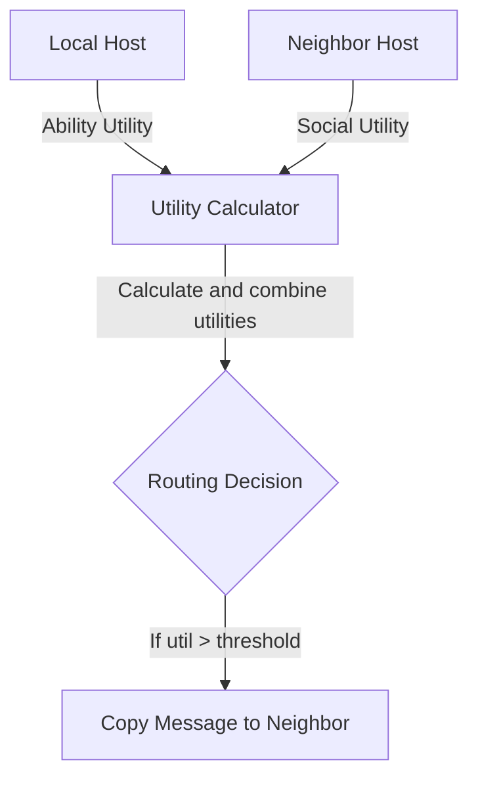
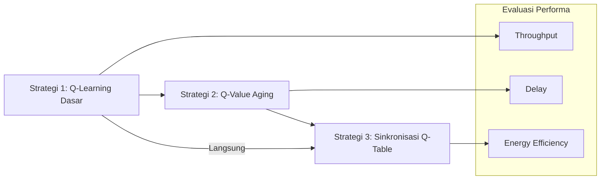

# CARL Utilitas

## Deskripsi
CARL Utilitas adalah modul utilitas untuk proyek CARL-DTN (Context-Aware Reinforcement Learning DTN) yang menggantikan pendekatan `routing.fuzzy.FCL` dengan pendekatan berbasis utilitas. Modul ini menyediakan perhitungan utilitas real-time untuk membantu pengambilan keputusan routing pada Delay Tolerant Network (DTN).

## Fitur Utama
- **Utility Calculation**: Menghitung utilitas berdasarkan dimensi fisik (Ability Utility) dan sosial (Social Utility).
- **Ability Utility**: Berbasis kapasitas buffer dan sisa energi baterai.
- **Social Utility**: Berbasis popularitas node (encounter frequency) dan kekuatan ikatan sosial (tie strength).
- **Modular**: Mudah diintegrasikan ke `RLRouter` dan `UtilityBasedCopyController`.
- **Konfigurasi Dinamis**: Bobot utilitas dapat diatur melalui konfigurasi eksternal.

## Instalasi
1. Salin package `routing.utilitas` ke dalam direktori `src/` proyek CARL-DTN.
2. Tambahkan dependency jika diperlukan (tidak ada dependency eksternal selain core ONE Simulator).
3. Pastikan file `RL_settings.txt` memuat parameter utilitas berikut:
   ```ini
   # Utility Weights
   AbilityWeight = 0.5
   SocialWeight  = 0.5
   ```

## Struktur Paket

## Diagram Konsep Node


```
src/routing/utilitas/
├── AbilityUtilityCalculator.java  # Menghitung utilitas fisik
├── SocialUtilityCalculator.java   # Menghitung utilitas sosial
├── UtilityCalculator.java         # Menggabungkan kedua utilitas
└── UtilityBasedCopyController.java # Controller logika copy berbasis utilitas
```

## Konfigurasi
Parameter utama di `RL_settings.txt`:

| Parameter       | Deskripsi                                                  | Default |
|-----------------|------------------------------------------------------------|---------|
| AbilityWeight   | Bobot utilitas fisik (0.0 - 1.0)                           | 0.5     |
| SocialWeight    | Bobot utilitas sosial (0.0 - 1.0)                          | 0.5     |
| EnableUtilitas  | Toggle penggunaan modul utilitas (`true` / `false`)       | true    |

## Cara Menggunakan
1. Pastikan `EnableUtilitas=true` di `RL_settings.txt`.
2. Jalankan simulasi CARL-DTN.
3. `RLRouter` otomatis memanggil `UtilityCalculator` untuk menentukan peer terbaik.
4. `UtilityBasedCopyController` akan menentukan jumlah salinan pesan berdasarkan utilitas.

## Contoh Penggunaan
```java
// Inisialisasi UtilityCalculator
UtilityCalculator calc = new UtilityCalculator(settings);

// Hitung utilitas peer
double util = calc.calculate(localHost, neighborHost);

// Gunakan utilitas dalam routing decision
if (util > threshold) {
    router.copyMessage(msg, neighborHost);
}
```

## Kontribusi
Kontribusi sangat disambut! Silakan:
1. Fork repository ini.
2. Buat branch fitur (`git checkout -b fitur-baru`).
3. Commit perubahan Anda (`git commit -m "Tambah fitur utilitas baru"`).
4. Push ke branch (`git push origin fitur-baru`).
5. Buat Pull Request.

## Strategi Reinforcement Learning

Berikut adalah tiga strategi utama yang digunakan dalam modul CARL Utilitas untuk reinforcement learning:

1. **Strategi 1: Q-Learning Dasar**
   - Algoritma inti yang memperbarui Q-value berdasarkan reward langsung.
   - Tidak ada mekanisme penuaan nilai (aging), sehingga nilai lama tetap sama sampai diupdate.
   - Cocok untuk skenario dengan kondisi relatif stabil.

2. **Strategi 2: Q-Value Aging**
   - Menambahkan faktor `aging` yang mengurangi Q-value lama secara bertahap.
   - Membantu sistem beradaptasi saat kondisi jaringan berubah dinamis.
   - Formula update: `Q(s,a) = (1 - decay) * Q(s,a) + decay * (reward + γ * max Q(...))`.

3. **Strategi 3: Sinkronisasi Q-Table Antar Node**
   - Setiap node secara berkala menukar ringkasan Q-table dengan neighbor.
   - Meningkatkan konsistensi pengetahuan global dan mempercepat konvergensi.
   - Sinkronisasi dapat dilakukan dengan full sync atau partial sync (hanya state penting).

## Diagram Strategi RL



## Lisensi
Lisensi MIT. Lihat file [LICENSE](LICENSE) untuk detail.

