# CARL Utilitas

**CARL Utilitas** adalah modul untuk proyek **CARL-DTN** (*Context-Aware Reinforcement Learning for Delay-Tolerant Networks*) yang menggantikan pendekatan fuzzy logic dengan perhitungan utilitas real-time. Modul ini mendukung proses pengambilan keputusan routing dengan menghitung potensi node secara kontekstual berbasis dua dimensi utama: **fisik** dan **sosial**.

---

## 🔧 Fitur Utama

- ⚙️ **Utility Calculation**
  - Menghitung nilai utilitas berdasarkan kombinasi **Ability Utility** dan **Social Utility**.
- 🔋 **Ability Utility**
  - Berdasarkan kapasitas buffer dan sisa baterai node.
- 🧠 **Social Utility**
  - Berdasarkan popularitas (frekuensi encounter) dan kekuatan ikatan sosial (tie strength).
- 🧩 **Modular & Integratif**
  - Dapat digunakan di dalam `RLRouter` dan `UtilityBasedCopyController`.
- 🔄 **Konfigurasi Dinamis**
  - Parameter bobot utilitas dapat diatur melalui `RL_settings.txt`.

---

## 📁 Struktur Direktori

```
src/routing/utilitas/
├── AbilityUtilityCalculator.java        # Menghitung utilitas buffer & baterai
├── SocialUtilityCalculator.java         # Menghitung utilitas popularitas & ikatan sosial
├── UtilityCalculator.java               # Menggabungkan semua dimensi utilitas
└── UtilityBasedCopyController.java      # Logika copy message berbasis utilitas
```

---

## ⚙️ Instalasi

1. Salin folder `routing/utilitas/` ke dalam direktori `src/` proyek CARL-DTN.
2. Pastikan file `RL_settings.txt` memuat parameter berikut:

```ini
# Utility Weights
AbilityWeight = 0.5
SocialWeight  = 0.5
EnableUtilitas = true
```

3. Jalankan simulasi menggunakan `RLRouter`. Jika `EnableUtilitas=true`, maka `UtilityCalculator` akan otomatis digunakan.

---

## 🧮 Perhitungan TOPP (Total Opportunistic Potential)

TOPP adalah nilai gabungan yang mencerminkan potensi node sebagai tujuan forwarding.

### 📌 Formula Utama:

\[
\text{TOPP}(i, j) = w_a \cdot U_{ability}(j) + w_s \cdot U_{social}(j)
\]

- \( i \): node pengirim
- \( j \): node target
- \( w_a \): bobot Ability Utility (`AbilityWeight`)
- \( w_s \): bobot Social Utility (`SocialWeight`)

### 🧩 Komponen Utilitas:

- **Ability Utility**:
  \[
  U_{ability}(j) = \frac{Buffer_{avail}(j)}{Buffer_{total}} \cdot \frac{Battery_{level}(j)}{Battery_{max}}
  \]

- **Social Utility**:
  \[
  U_{social}(j) = Popularity(j) \cdot TieStrength(i, j)
  \]

---

## 🤖 Contoh Penggunaan

```java
UtilityCalculator calc = new UtilityCalculator(settings);
double util = calc.calculate(localHost, neighborHost);

if (util > threshold) {
    router.copyMessage(msg, neighborHost);
}
```

---

## 🧠 Strategi Reinforcement Learning

Tiga strategi pembelajaran didukung dalam modul CARL Utilitas:

### 1. Q-Learning Dasar (Eq. 4 - CARL)

\[
Q(s, a) \leftarrow Q(s, a) + \alpha \left[ r + \gamma \cdot \max_{a'} Q(s', a') - Q(s, a) \right]
\]

- Tidak ada _aging_.
- Cocok untuk kondisi jaringan statis.

### 2. Q-Value Aging

\[
Q(s, a) \leftarrow (1 - \lambda) \cdot Q(s, a) + \lambda \cdot \left[ r + \gamma \cdot \max_{a'} Q(s', a') \right]
\]

- Mengadaptasi nilai Q terhadap perubahan jaringan.
- `lambda` dapat disesuaikan.

### 3. Sinkronisasi Q-Table

- Node berbagi **cuplikan Q-table** saat encounter.
- Bisa berupa full sync atau partial sync (state relevan saja).
- Mempercepat konvergensi pengetahuan.

---

## 📊 Diagram Strategi RL

```mermaid
graph LR;
    S1["Strategi 1: Q-Learning Dasar (Eq.4)"] --> S2["Strategi 2: Q-Value Aging"];
    S2 --> S3["Strategi 3: Sinkronisasi Q-Table"];
    S1 -->|Langsung| S3;

    subgraph Evaluasi
        P1["Throughput ↑"]
        P2["Delay ↓"]
        P3["Energy Efficiency ↑"]
    end

    S1 --> P1;
    S2 --> P2;
    S3 --> P3;
```



---

## 🎯 Perhitungan Reward (Opsional)

TOPP dapat digunakan sebagai dasar reward di dalam fungsi Q-Learning:

\[
r = \lambda_1 \cdot \Delta \text{TOPP} - \lambda_2 \cdot L_{copy}
\]

- \( \Delta \text{TOPP} \): selisih potensi peer dibanding node saat ini
- \( L_{copy} \): jumlah salinan pesan
- \( \lambda \): bobot reward/penalty (diatur dalam konfigurasi)

---

## 📄 Konfigurasi RL_settings.txt

| Parameter       | Deskripsi                                           | Default |
|----------------|-----------------------------------------------------|---------|
| AbilityWeight   | Bobot untuk Ability Utility                         | 0.5     |
| SocialWeight    | Bobot untuk Social Utility                          | 0.5     |
| EnableUtilitas  | Mengaktifkan modul utilitas (`true`/`false`)       | true    |
| DecayRate       | Nilai λ untuk Q-Value aging                        | 0.1     |
| Reward_TOPP     | Bobot reward berbasis TOPP                         | 1.0     |
| Penalty_Copy    | Penalti per salinan pesan                          | 0.5     |

---

## 📬 Kontribusi

1. Fork repo ini.
2. Buat branch: `git checkout -b fitur-anda`.
3. Commit: `git commit -m "Tambah fitur utilitas"`.
4. Push: `git push origin fitur-anda`.
5. Buat Pull Request.

---

## 📝 Lisensi

Lisensi MIT — Bebas digunakan dan dimodifikasi. Lihat file `LICENSE`.
